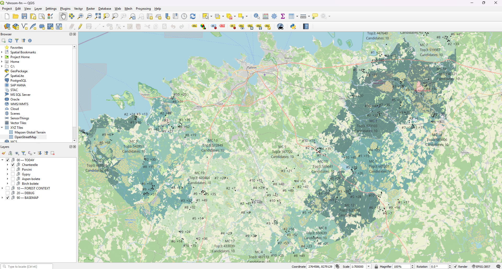
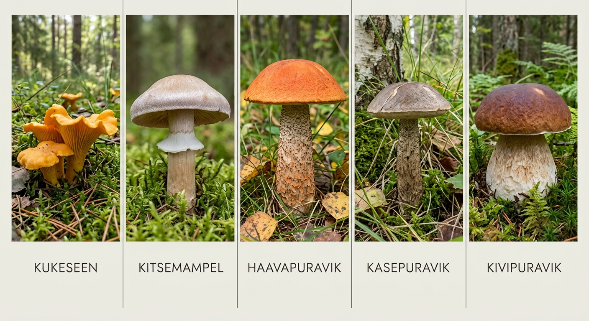

# shroom-fm 🍄

**Find out where to go mushroom foraging in Estonia today — not just "somewhere in the
forest," but which specific tree line, boundary, or region is actually worth the drive.**

shroom-fm reads Estonia's official forest registry, scores every forest stand for how
good a home it is for five prized wild-mushroom species, layers on live rain/temperature
data, and hands you a ranked, map-ready shortlist of places worth checking *this week* —
instead of you squinting at the Metsaregister web map guessing where the pine-bog edges
are.

<!-- IMAGE PLACEHOLDER: banner
     A wide hero image for the top of the README. Good options:
       - A real photo of one of the five target species (chanterelle, kitsemampel/gypsy
         mushroom, aspen bolete, birch bolete, or porcini) in situ, ideally on a pine/
         mixed-forest floor.
       - A stylized screenshot of the QGIS/web map output (see the map placeholder
         further down) cropped into a wide banner.
     Save as docs/images/banner.png and reference it here:
     
-->

---

## What this actually is (and isn't)

This is a **decision-support tool**, not a treasure map. It answers "out of the whole
country, which handful of places are statistically worth a special trip today?" — it
does not, and cannot yet, tell you "there is a 73% chance of porcini at this exact
GPS pin." See [How honest is this, really?](#how-honest-is-this-really) below before you
trust it too much.

It's built for two kinds of people:

- **A forager** who wants a shortlist instead of driving randomly and hoping.
- **A mycologist / GIS person** who wants a transparent, inspectable model — every score
  is decomposed into interpretable pieces (habitat, boundary richness, weather, access)
  rather than one opaque number, and every "I don't know" stays an honest `null` instead
  of a fabricated zero.

---

## How it thinks (the short version)

```
forest suitability          →  StandHabitatScore     (is this tree/soil combo good for species X?)
boundary / exploration value →  EcotoneScore          (is the *edge* between two stands unusually rich?)
current weather conditions   →  FruitingScore         (has it rained enough, recently enough, right now?)
practical reachability       →  AccessScore           (is there a road nearby?)
                                        ↓
                                  ScoutScore = habitat/boundary × weather × access
```

The four ingredients are kept **separate** and only multiplied together at the very end.
That's deliberate: a gorgeous forest in a three-week dry spell should show up as "great
forest, bad timing" — not silently get buried as "mediocre." A perfect rainy week over a
clear-cut should show up as "nothing here regardless of weather," not get inflated by the
weather score. Multiplying instead of averaging also means **one missing ingredient
kills the score** — no amount of good weather compensates for a spot you can't actually
reach.

<!-- IMAGE PLACEHOLDER: pipeline-diagram
     A cleaner, illustrated version of the ASCII flow above -- four labeled boxes
     (Habitat / Ecotone / Weather / Access) feeding into one "ScoutScore" box, with small
     icons (a tree, a boundary line, a raincloud, a road). Can be drafted quickly in
     any diagramming tool (e.g. Excalidraw, Figma) or even a whiteboard photo.
     Save as docs/images/pipeline-diagram.png:
     
-->

---

## Getting started

You'll need [uv](https://docs.astral.sh/uv/) (Python package manager) and a place you
want to forage from.

```bash
git clone <this repo>
cd shroom-fm
uv sync

# Tell it where "home" is -- everything is scored within a radius of this point.
cp config.example.toml config.toml
# edit config.toml: home_lat / home_lon, decimal degrees (WGS84)
```

Run the full pipeline once (downloads real forest/road data, computes all the static
scores — takes a while the first time since it's pulling ~260k+ real forest stands):

```bash
uv run python main.py
```

Then, whenever you actually want to plan a trip (weather changes daily — this is the
only part you need to re-run often):

```bash
uv run python scripts/refresh_weather.py
uv run python scripts/score_fruiting.py
uv run python scripts/score_ecotone_fruiting.py
uv run python scripts/export_scout_candidates.py
uv run python scripts/rollup_macroclusters.py
```

That last step produces the two files you actually care about:

- **`data/scout_candidates.geojson`** — the individual spots, ranked.
- **`data/macrocluster_state.geojson`** — a per-region "is it worth driving out here
  today at all" summary, 22 regions covering the whole download radius.

Open both in [QGIS](https://qgis.org/) (free) or any GeoJSON-friendly map viewer. Both
are plain WGS84 lon/lat — no reprojection needed.

<!-- IMAGE PLACEHOLDER: map-example
     A real screenshot of your own QGIS project after loading scout_candidates.geojson
     (filtered to tier == "ranked") over a basemap (OpenStreetMap works fine as a QGIS
     XYZ layer). Color points by species, size or color by scout_score. This is the
     single most useful image for a newcomer to see -- it's the actual payoff.
     Save as docs/images/map-example.png:
     
-->

Full field-by-field documentation of every output file (what each column means, real
example rows, suggested QGIS symbology) lives in
[`docs/production-data-contract.md`](docs/production-data-contract.md) — written to be
handed to an LLM or a GIS collaborator with zero prior context on this repo.

---

## How to actually read the scores

Every candidate carries several scores, not one. Here's the practical "should I drive
out here" read, tuned to this project's current real output ranges:

### The region-level question: is this area worth driving to at all?

Look at `macrocluster_state.geojson` first, not individual points — one strong region
beats one lucky point.

| `today_top3_mean_score_{species}` | Read it as |
|---|---|
| ≥ 0.60 | **Strong region** — several good options, worth a special trip |
| 0.50 – 0.60 | Solid, ordinary working region |
| 0.40 – 0.50 | Borderline — only if you're already nearby |
| < 0.40 | Usually skip |

Prefer `top3_mean_score` over `top_score` alone — one lucky #1 spot can be a fluke or
awkward to actually reach; three genuinely good spots means the *region* is reliably
good, not just one point.

### The spot-level question: is this specific target worth walking to?

| `scout_score` | Read it as |
|---|---|
| ≥ 0.70 | **Very strong candidate** — clearly worth checking |
| 0.55 – 0.70 | Good working target |
| 0.40 – 0.55 | More of a "stop on the way" than a reason to drive out |
| < 0.40 | Weak signal — not worth a special trip |

### A quick green/yellow/red rule of thumb

```
GO      region top3_mean ≥ 0.55  AND  at least one target scout_score ≥ 0.65
        AND that target's fruiting_score ≥ 0.50  AND weather coverage ≥ 0.90

MAYBE   region top3_mean ≥ 0.45  AND  at least one target scout_score ≥ 0.50
        AND that target's fruiting_score ≥ 0.35

SKIP    everything else
```

Highlight `GO`/`MAYBE`/`SKIP` at the *region* level on your map, then drill into the
region's top 3 individual targets — that mirrors how the data is actually structured
(`macrocluster_state.geojson` → `scout_candidates.geojson`).

### Reading the three sub-scores individually

**`ecotone_score`** — how good the specific forest/boundary is, ignoring weather:

```
< 0.6       average or weak habitat boundary
0.6 – 0.85  good
0.85 – 1.0  very good
> 1.0       standout ecotone (only possible on boundaries — a "sample several
            habitats on one walk" bonus is baked in above 1.0)
```

A high `ecotone_score` with a low `fruiting_score` means "excellent forest, wrong
moment" — worth remembering for later in the season, not worth driving to today.

**`fruiting_score`** — is *right now* a good moisture/temperature window, regardless of
forest quality:

```
< 0.25       almost nothing happening today
0.25 – 0.40  weak window
0.40 – 0.55  working window
0.55 – 0.70  good window
> 0.70       very strong weather window
```

This one is worth an absolute threshold, not just a relative "best available today"
comparison — if the whole country is having a dry week, the best available spot is still
a mediocre day, not a good one.

**`access_modifier`** — roughly, distance to the nearest road (linear falloff, capped at
1500m):

```
1.0 ≈ 0m from a road      0.5 ≈ 750m      0.0 ≈ 1500m+ / no road at all
```

`≥ 0.5` (roughly within 750m of a road) is a reasonable cutoff for a "convenient" target
— but don't rule out 0.3–0.5 if the habitat and weather scores are exceptional.

---

## The five species this targets

| Species | Estonian | Look for |
|---|---|---|
| Chanterelle | kukeseen | Pine and pine-mixed forest; occurs in patches, so a previous good spot stays good |
| Gypsy mushroom | kitsemampel | Sparse, open pine — especially pine forest edging into bog |
| Aspen bolete | haavapuravik | Anywhere with a meaningful aspen component, even in a mixed stand |
| Birch bolete | kasepuravik | Birch presence is the main signal — dry *or* moist forest both count |
| Porcini | kivipuravik / porcini | Spruce and spruce-mixed forest primarily, pine-associated porcini also relevant |

Milk caps, russulas, and other edible-but-lower-value species aren't scored here — the
model is deliberately narrow rather than trying to cover everything at once.

<!-- IMAGE PLACEHOLDER: species-grid
     A 5-photo grid, one real photo per target species (chanterelle, kitsemampel, aspen
     bolete, birch bolete, porcini), captioned with the Estonian name. Good source:
     your own foraging photos, or credited stock/CC-licensed mushroom photography.
     Save as docs/images/species-grid.png:
     
-->

---

## How honest is this, really?

Worth saying plainly, because a ranked list with decimal scores can look more certain
than it is:

- **As a tool for narrowing down where to scout**, this is fairly mature: the
  architecture keeps forest quality, boundary richness, current weather, and
  reachability as four separate, inspectable numbers instead of one opaque score, "I
  don't have data" is never silently treated as "the answer is zero" or "the answer is
  bad," and candidates are ranked *within each region* rather than letting a handful of
  outliers near one town crowd out the rest of the country.
- **As a model that predicts actual mushroom yield**, it is not there yet. The
  ecological weights (which tree species matter how much, which site types are good,
  how much a rain event should count) are hand-picked from mycological literature and
  Estonian forestry sources — reasonable, but not yet checked against real logged finds.
  A score of `0.71` should be read as "clearly better than `0.35`," not as "precisely 18%
  better than `0.60`."
- Rain data comes from weather radar over a 2km grid cell, not soil-moisture sensors —
  two forests in the same radar pixel can have very different actual ground moisture
  (canopy cover, drainage, moss). `fruiting_score` means "weather conditions are
  compatible with fruiting," not "mushrooms are confirmed fruiting here."
- `access_modifier` is a straight-line distance to the nearest mapped road, not a real
  routing model — it doesn't know about gates, rivers between the road and the target,
  or which side to approach from.
- The biggest missing piece is a **feedback loop**: this project doesn't yet learn from
  real trips. Once a season of logged observations exists (species, date, effort spent,
  yield, fresh/old), the ecological weights above can be checked and recalibrated
  against reality instead of resting on priors alone.

In short: trust it for **"which handful of regions and spots should I check first"** —
don't trust it yet for **"how many mushrooms will I actually find here."**

---

## Data sources

All real, live data — nothing in this pipeline is simulated or sampled:

- **[Metsaregister](https://gsavalik.envir.ee/)** (Estonian Forest Registry, run by
  Keskkonnaagentuur / the Estonian Environment Agency) — forest stand geometry, tree
  species composition, site type. Published as open data under **CC-BY 4.0**.
- **ETAK** (Estonian Topographic Database) — road and barrier geometry, from the same
  Keskkonnaagentuur WFS service, used for the access/reachability score.
- **[EUMETNET OPERA](https://www.eumetnet.eu/activities/observations-programme/current-activities/opera/)**
  — pan-European weather radar precipitation composite (15-minute, 2km grid), the source
  for all rainfall features.
- **[MET Norway](https://www.met.no/)** MET-Nordic / MEPS analysis grid — hourly
  temperature and humidity.

If you build on this project, please keep crediting these sources — they're doing the
actual expensive work of collecting the underlying data.

---

## Contributing observations

The single most valuable thing a user of this tool can do right now is **log what you
actually find** — species, date, location, effort spent, and yield (including "found
nothing," which matters just as much as a good find). There's no logging UI yet; if
you're interested in helping build the feedback loop described above, that's the most
useful place to start a conversation.

---

## For developers

This README is intentionally non-technical. If you're here to modify the pipeline
itself, start with [`CLAUDE.md`](CLAUDE.md) — it documents the real architecture, every
script's real production timings, known real-data quirks, and the full run order for
each of the pipeline's stages. `docs/production-data-contract.md` documents every output
file's real schema. `docs/superpowers/` holds the design specs and implementation plans
behind each major feature.
